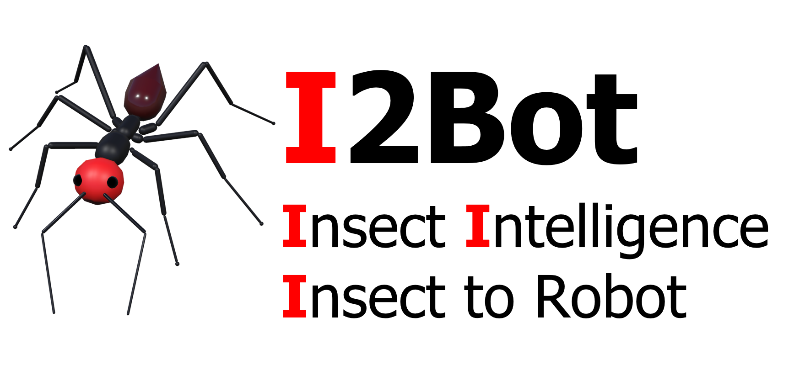
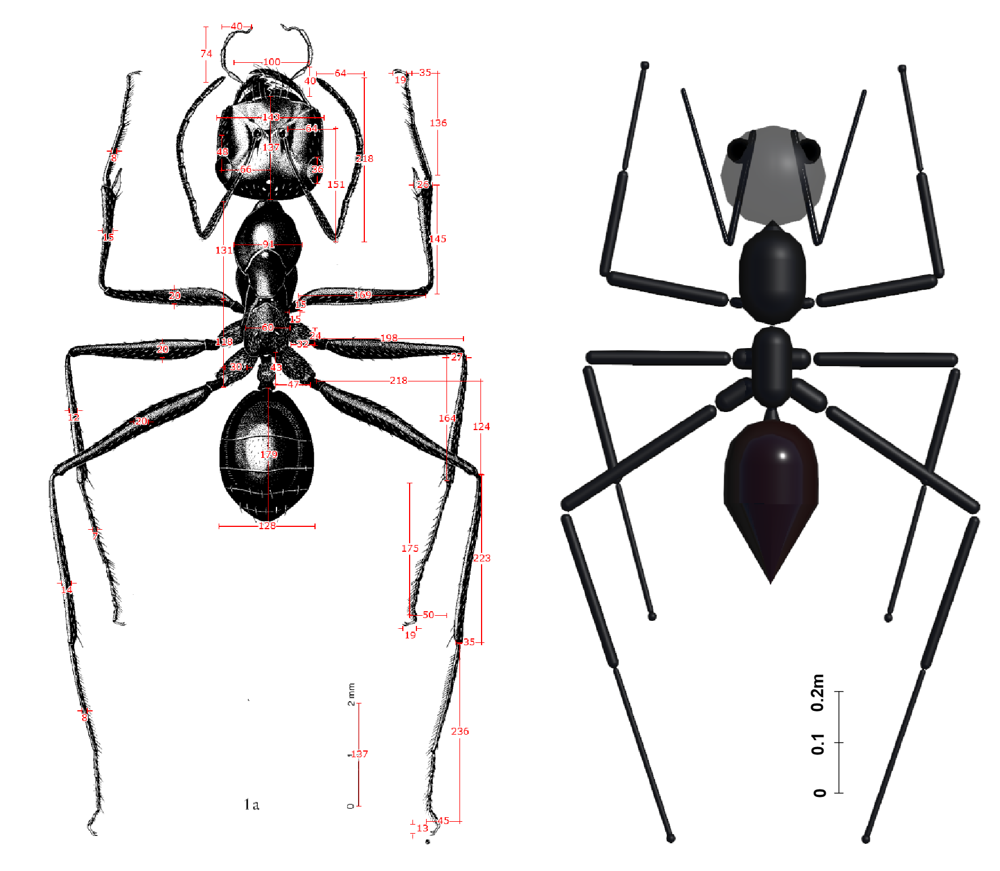
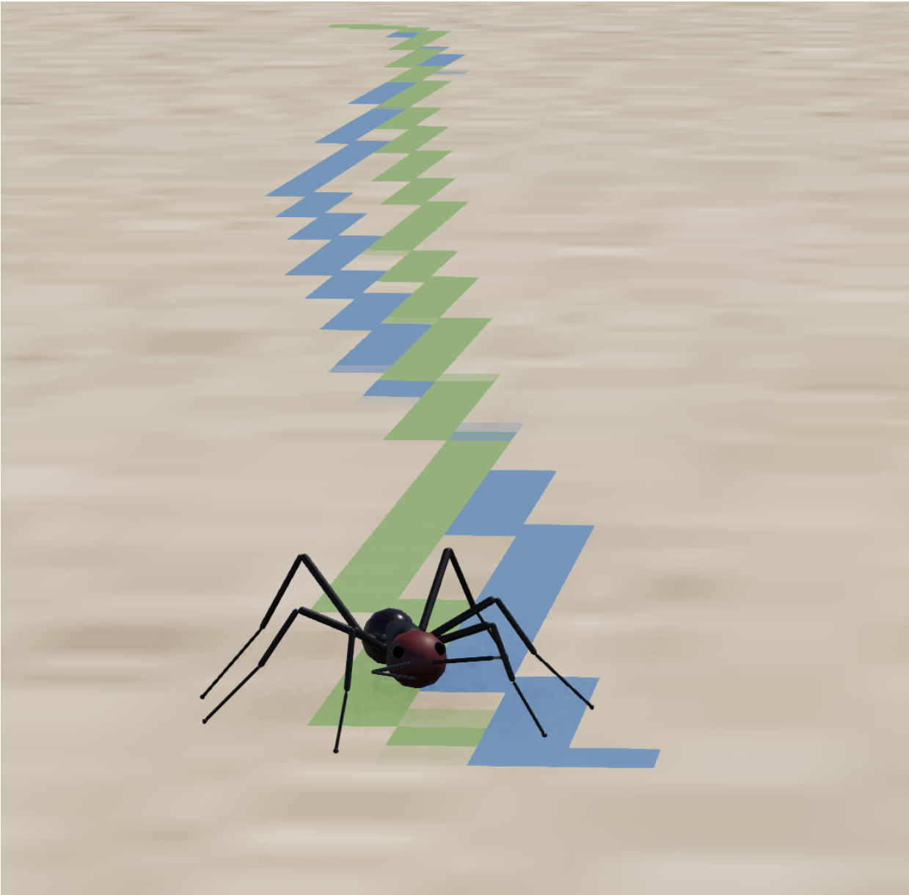
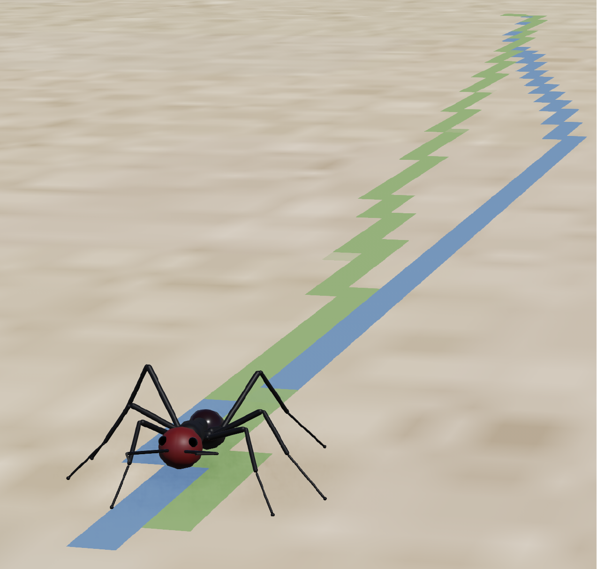
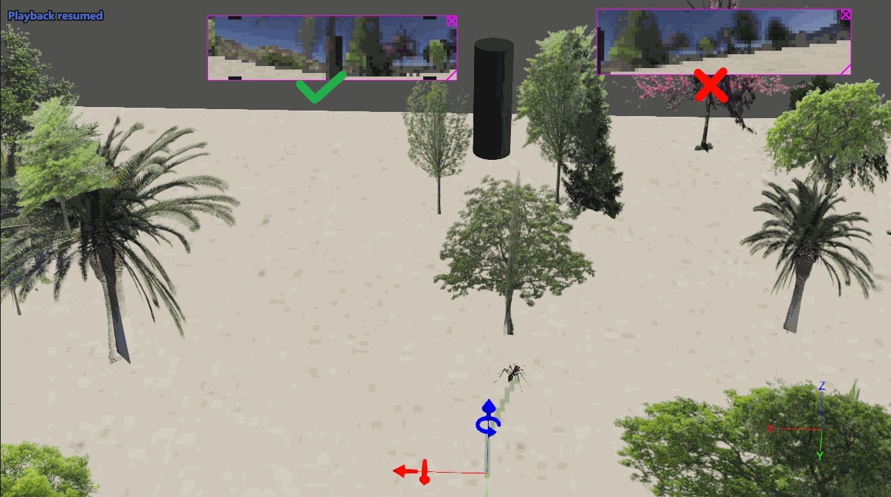
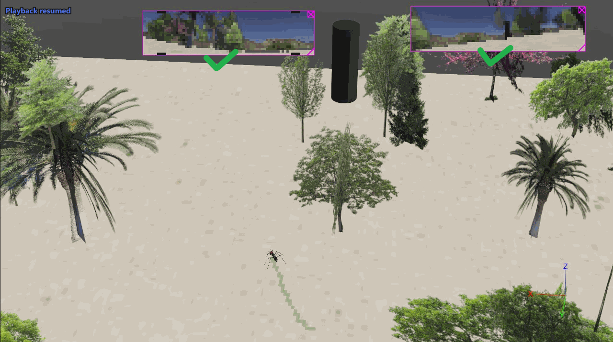
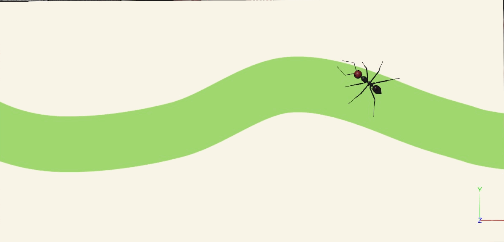
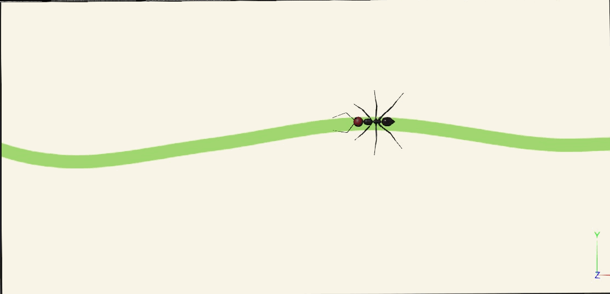

<!--  -->

<div align='center'>
  
  <div></div>
  

  

  <i> <font size="4"> I2Bot: A open-source tool for simulating multi-modal and embodied insect navigation</font> </i>
</div>

---

### Files
Files are constructed as a Webots project
```shell
|-- controllers
|   |-- I2Bot  # main controller for robot
|   |   |-- I2Bot.py
|   |   |-- constant.py
|   |   |-- data # directory to store simulation data
|   |   |-- navigation.py # models for navigation
|   |   |-- robots.py
|   |   |-- urdf # URDF file of the robot legs
|   |   |   |-- front_leg.urdf
|   |   |   |-- hind_leg.urdf
|   |   |   |-- middle_leg.urdf
|   |   |-- utils.py
|   |   |-- walker.py # FK and IK gait control
|   |-- odor_plume_supervisor # controller for simulating odor plume
|   |   |-- odor_plume_supervisor.py
|   |   |-- pompy
|   |       |-- models.py
|   |       |-- processors.py
|-- libraries
|-- plugins
|   -- remote_controls
|-- protos
|   |-- AIBot.proto # proto file for robot
|   |-- puff.proto # proto file for odor puffs (spheres)
|-- worlds # Webots World files for demos 
|   |-- gait_control.wbt
|   |-- gait_control_adhension.wbt
|   |-- gait_control_uneven.wbt
|   |-- odor_plume_tracking.wbt
|   |-- odor_trail_following.wbt
|   |-- path_integration.wbt
|   |-- visual_beacons.wbt
|   |-- visual_compass.wbt
|   |-- textures
|   |   |-- sand.jpg
|   |   |-- trial_loop.png
|   |   |-- trial_narrow.png
|   |   |-- trial_normal.png
|   |   |-- trial_wide.png
```
### Morphology
The morphology and the positions of each organs and limbs are reconstructed by the measurements of real desert ant *Cataglyphis fortis* by Wehner.


### Demos
#### Locomotion
gait control using forward kinematics and inverse kenimatics on ground and climbing the wall.
  | |  | 
  | --- | --- 

Walking on uneven terrain:

#### Path Integration
The biologically constrained model proposed by [Stone et.al, 2017](https://www.sciencedirect.com/science/article/pii/S0960982217310904) has been implemented and connected with the locomotion control to generate bio-realistic *Path Integration* behaviors. This the first time, the PI model has been modelled in the manner of completed **sensory-motor closed loop**.
|||
---|---|

Blue and green trajectories depict the outbound (foraging) and inbound (homing) travels.

#### Vision
+ binocular

  The visual beacons behaviors utilizing left, right and binocular visual inputs:
  | | |
  |---|---|
  |monocular / left eye||
  |monocular / right eye||
  |binocular||

+ panoramic
The visual compass behavior is simulated as the agent still tracking the certain direction decoded from the panoramic image view:


As the ant robot always headed to the red ball in the artificial visual sceene.

#### Olfactory
+ Odor trail
  The sensory-motor loop of olfactory guided behavior demonstrated by the efficient odor trail following utilizing antennae sweeping:

  | | |
  |---|---|
  |wide trail||
  |normal trail||

+ Odor plume
  Plume tracking of walking insect in turbulent odor environment:
  


### How to run the demos
Like any Webots project, open the `.wbt` file, find the node of the robot in the `scene tree`, set the `controller` field of the robot node to be `I2Bot`. You may need to change the code in the `I2Bot.py` file:

```python
# demo of ['gait', 'PI', 'VisualBeacon', 'VisionCompass', 'OdorPlumeTracking', 'OdorTrialFollowing']
demo = 'VisionCompass'

# omitted code....

if demo == 'VisionCompass':
    agent = NavigationController('VisualCompass_test')
    agent.visual_compass(vs_mode='jump', timeout=120) # set vs_mode to alter the mode of visual scene changing
    agent.logger.save()
```

and then press the `run` button to run the simulation.

+ odor trail following
  When using the `odor_trail_following.wbt` world file. you man need to change the `texture` of the `arena` node to change the width of the odor trail.
+ odor plume tracking
  When using the `odor_plume_tracking.wbt` world file, you may need also modify the `controller` of the olfactory node to change the dynamics of the odor simulation. 
