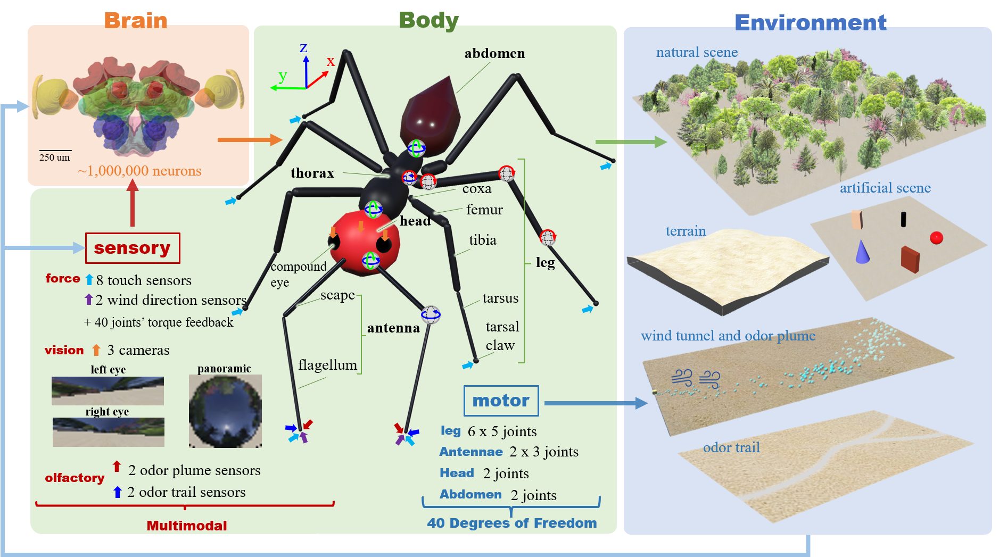
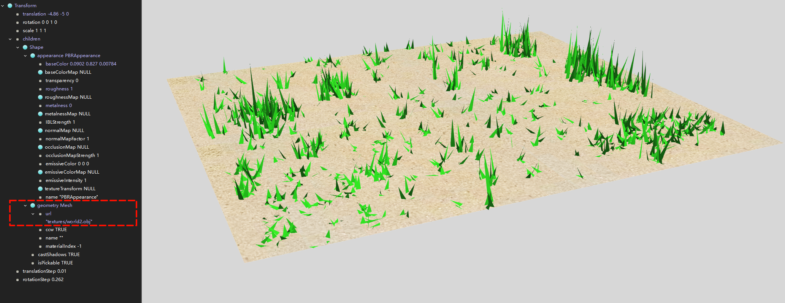

<!--  -->

<div align='center'>
  
  <div></div>
  <!--  -->

  
  <a></a>

  <i> <font size="5"> I2Bot: An open-source tool for simulating multi-modal and embodied insect navigation</font> </i>
</div>

---
**This tool aims to integrate simulation of brain, body, and environment, encompassing the sensory-motor loop:**


#### Linked paper
+ preprint:

[Sun, X., Mangan, M., Yue, S., & Peng, J. (2024). I2Bot: an open-source tool for multi-modal and embodied simulation of insect navigation. bioRxiv, 2024-07.](https://www.biorxiv.org/content/10.1101/2024.07.11.603012v1.full)

### Files
Files are constructed as a [Webots project](https://www.cyberbotics.com/doc/guide/tutorial-1-your-first-simulation-in-webots?version=master)
```shell
|-- controllers
|   |-- I2Bot  # main controller for robot
|   |   |-- I2Bot.py
|   |   |-- constant.py
|   |   |-- data # directory to store simulation data
|   |   |-- navigation.py # models for navigation
|   |   |-- robots.py
|   |   |-- urdf # URDF file of the robot legs
|   |   |   |-- front_leg.urdf
|   |   |   |-- hind_leg.urdf
|   |   |   |-- middle_leg.urdf
|   |   |-- utils.py
|   |   |-- walker.py # FK and IK gait control
|   |-- odor_plume_supervisor # controller for simulating odor plume
|   |   |-- odor_plume_supervisor.py
|   |   |-- pompy # Puff-based odour plume model in Python: https://github.com/InsectRobotics/pompy
|   |       |-- models.py
|   |       |-- processors.py
|-- libraries
|-- plugins
|   -- remote_controls
|-- protos
|   |-- AIBot.proto # proto file for robot
|   |-- puff.proto # proto file for odor puffs (spheres)
|-- worlds # Webots World files for demos 
|   |-- gait_control.wbt
|   |-- gait_control_adhension.wbt
|   |-- gait_control_uneven.wbt
|   |-- odor_plume_tracking.wbt
|   |-- odor_trail_following.wbt
|   |-- path_integration.wbt
|   |-- visual_beacons.wbt
|   |-- visual_compass.wbt
|   |-- robot.wbt # a robot demo
|   |-- textures
|   |   |-- sand.jpg
|   |   |-- trial_loop.png
|   |   |-- trial_narrow.png
|   |   |-- trial_normal.png
|   |   |-- trial_wide.png
|-- media # files for README.md
```
### Robot Morphology
The morphology and the positions of each organs and limbs are reconstructed by the measurements of real desert ant *Cataglyphis fortis* by Wehner. For more details see the paper:

[Wehner, R. (1983). Taxonomie, Funktionsmorphologie und Zoogeographie der saharischen Wüstenameise Cataglyphis fortis (Forel 1902) stat. nov. Senckenbergiana biol, 64, 89-132.](https://www.antsofafrica.org/ant_species_2012/cataglyphis/cataglyphis_fortis/wehner-1983-3052.pdf)

</img>

### Demos
#### Locomotion
gait control using forward kinematics and inverse kenimatics on ground and climbing the wall.
  | |  | 
  | --- | --- 

Walking on uneven terrain:

#### Path Integration
The biologically constrained model proposed by [Stone et.al, 2017](https://www.sciencedirect.com/science/article/pii/S0960982217310904) has been implemented and connected with the locomotion control to generate bio-realistic *Path Integration* behaviors. This the first time, the PI model has been modelled in the manner of completed **sensory-motor closed loop**.
|||
---|---|

Blue and green trajectories depict the outbound (foraging) and inbound (homing) travels.

#### Vision
+ binocular

  The visual beacons behaviors utilizing left, right and binocular visual inputs:
  | | |
  |---|---|
  |monocular / left eye||
  |monocular / right eye||
  |binocular||

+ panoramic
The visual compass behavior is simulated as the agent still tracking the certain direction decoded from the panoramic image view:


As the ant robot always headed to the red ball in the artificial visual sceene.

#### Olfactory
+ Odor trail
  The sensory-motor loop of olfactory guided behavior demonstrated by the efficient odor trail following utilizing antennae sweeping:

  | | |
  |---|---|
  |wide trail||
  |normal trail||

+ Odor plume
  Plume tracking of walking insect in turbulent odor environment:
  

+ Embodiment: varied antenna lengths
  

  This also demonstrate the potential of I2Bot for multiple agent simulation, i.e., *Swarm Intelligence and Swarm Robotics*

### How to run the demos
1. Download and install open-sourced Webots from:https://cyberbotics.com/.
2. Follow [this tutorial](https://cyberbotics.com/doc/guide/programming-fundamentals) to setup the programm language environment (support C/C++, Java, Python or MATLAB)
3. Like any Webots project, open the `.wbt` file, find the node of the robot in the `scene tree`, set the `controller` field of the robot node to be `I2Bot`. You may need to change the code in the `I2Bot.py` file:

```python
# demo of ['gait', 'PI', 'VisualBeacon', 'VisionCompass', 'OdorPlumeTracking', 'OdorTrialFollowing']
demo = 'VisionCompass'

# omitted code....

if demo == 'VisionCompass':
    agent = NavigationController('VisualCompass_test')
    agent.visual_compass(vs_mode='jump', timeout=120) # set vs_mode to alter the mode of visual scene changing
    agent.logger.save()
```

and then press the `run` button to run the simulation.

+ odor trail following
  When using the `odor_trail_following.wbt` world file. you man need to change the `texture` of the `arena` node to change the width of the odor trail.
+ odor plume tracking
  When using the `odor_plume_tracking.wbt` world file, you may need also modify the `controller` of the olfactory node to change the dynamics of the odor simulation. 

### Customize the 3D visual world
Since Webots supports importing 3D object (a geometry and appearance from a `.dae` or `.obj` file) via the `CadShape` node or `Shape->Geometry->Mesh` node, it is easy to modify the 3D world. 

Previous visual navigation studies apply simulated 3D world defined by a `.mat` file, one can transfer this to a `.obj` file by codes like:
```python
def visual_world_mat2obj(mat_filename, obj_filename):
    w = sio.loadmat(mat_filename)
    with open(obj_filename, 'w') as f:
        for i in range(w['X'].shape[0]):
            for j in range(3):
                f.write(f"v {w['X'][i, j]} {w['Y'][i, j]} {w['Z'][i, j]}\n")
            # f.write(f"v {w1['X'][i, 0]} {w1['Y'][i, 0]} {w1['Z'][i, 0]}\n")
        for i in range(w['X'].shape[0]):
            s = i * 3
            f.write(f"f {s+1} {s+2} {s+3}\n")

visual_world_mat2obj('world.mat', 'world.obj')
```
then import to Webots (add the file name in the `url` field of node `Shape->Geometry->Mesh`) and set the appearance as you like:


### Questions, Feature Requests and Bugs
If you want to ask any questions, request new features and report bugs, please refer to the [`issues`](https://github.com/XuelongSun/I2Bot/issues) page.


